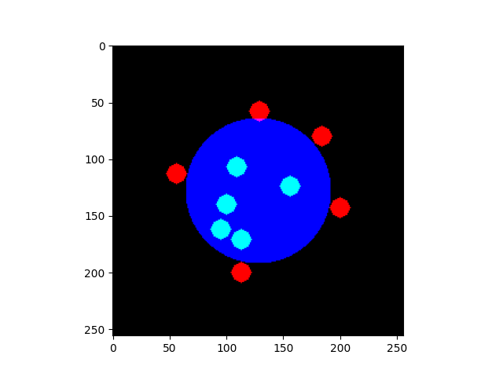
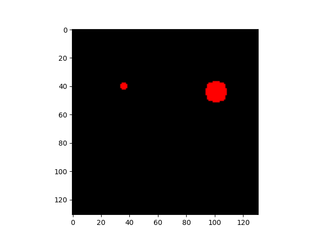

# ISISIM
**I**nteractive **S**egmentation **I**nteraction **SIM**ulation : simulate user interaction for interactive segmentation algorithms.

## Examples
*blue = label, green = positive click, red = negative click, the click maps are dilated for better visualization.*

## References
* [Deep Interactive Object Selection (Xu et al. 2016)](https://arxiv.org/abs/1603.04042) [:scroll:](references/1603.04042.pdf)

## Benchmark
More details in example*.py benchmark functions.

* image size : (256 x 256 x 256)
* batch size : 32
* clicks : 10

proportion of positive label : 48.7%.

| function | time (s) |
| --- | --- |
| gen_click_random_uniform | 0.148 |
| gen_click_random_uniform_advanced | 46.085 |
| gen_click_around_border | 62.642 |
| *inverted label* | |
| gen_click_random_uniform | 0.196 |
| gen_click_random_uniform_advanced | 47.545 |
| gen_click_around_border | 68.518 |

proportion of positive label : 0.8%.

| function | time (s) |
| --- | --- |
| gen_click_random_uniform | 0.047 |
| gen_click_random_uniform_advanced | 13.984 |
| gen_click_around_border | 2.859 |
| *inverted label* | |
| gen_click_random_uniform | 0.313 |
| gen_click_random_uniform_advanced | 97.604 |
| gen_click_around_border | 6.725 |

If you are interested in user interaction simulation, this repository may interest you :
[SegmentationToScribble](https://github.com/Cyril-Meyer/SegmentationToScribble)
