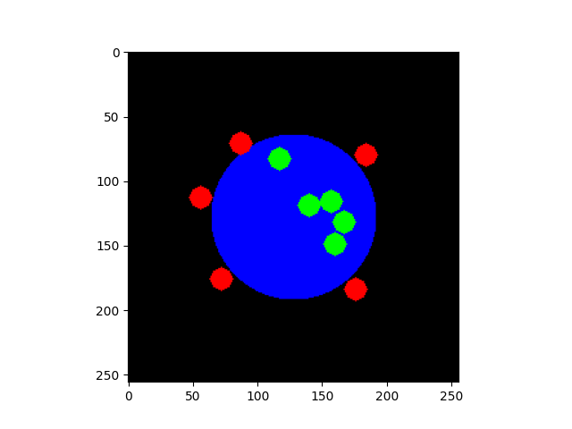

# ISISIM
**I**nteractive **S**egmentation **I**nteraction **SIM**ulation : simulate user interaction for interactive segmentation algorithms.

## Examples
*blue = label, green = positive click, red = negative click, the click maps are dilated for better visualization.*

## References
* [Deep Interactive Object Selection (Xu et al. 2016)](https://arxiv.org/abs/1603.04042) [:scroll:](references/1603.04042.pdf)

-----
If you are interested in user interaction simulation, this repository may interest you :
[SegmentationToScribble](https://github.com/Cyril-Meyer/SegmentationToScribble)
