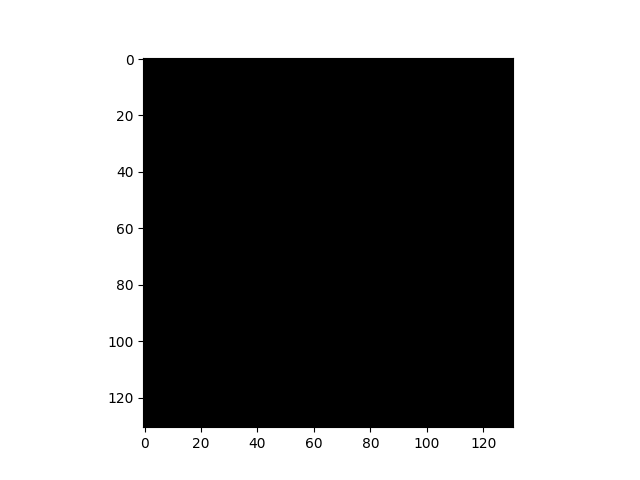
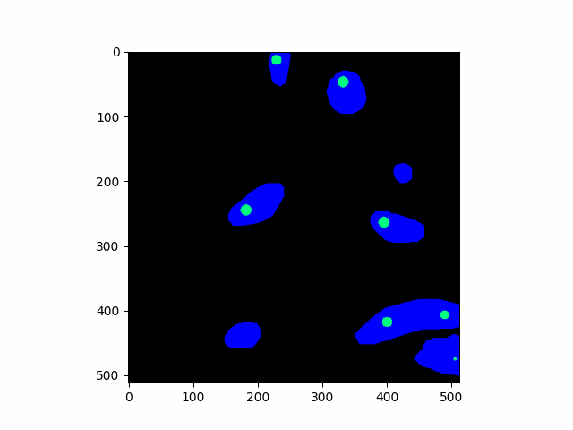

# ISISIM
**I**nteractive **S**egmentation **I**nteraction **SIM**ulation : simulate user interaction for interactive segmentation algorithms.

## Examples
*blue = label, green = positive click, red = negative click, the click maps are dilated for better visualization.*  
α *: random uniform (+) around border (-).* β *: extreme points.* γ *: random fill.*

| algo | single object | multiple objects |
| --- | --- | --- |
| α |  |  |
| β |  |  |
| γ |  |  |
| α |  |  |
| β |  |  |
| γ |  |  |

## Benchmark
More details in example*.py benchmark functions.

* single object image size : (256 x 256 x 256)
* multiple objects image size : (165, 512, 512)
* batch size : 32 (get_click_extreme_points is run only once)
* clicks : 10
* legend
  * α : single object, proportion of positive label : 48.7%
  * α- : α inverted label
  * β : single object, proportion of positive label : 0.8%
  * β- : β inverted label
  * γ . multiple objects, proportion of positive label : 5.2%
  * γ- : γ inverted label

| function | α | α- | β | β- | γ | γ- |
| --- | --- | --- | --- | --- | --- | --- |
| generatorS.gen_click_random_uniform | 0.1 | 0.1 | 0.1 | 0.3 | 2.6 | 2.7 |
| generatorS.gen_click_random_uniform_advanced | 46.0 | 47.5 | 13.9 | 97.6 | 32.8 | 125.9 |
| generatorS.gen_click_around_border | 62.6 | 68.5 | 2.8 | 6.7 | 49.0 | 236.7 |
| generatorS.get_click_extreme_points | 0.7 | 0.7 | 0.3 | 1.2 | 14.9 | 7.0 |
| generatorS.gen_click_fill   :warning: depends a lot on the d_step parameter | 70.3 | 132.8 | 0.5 | 706.6 | 5.1 | 48.6 |

## References
* [Deep Interactive Object Selection (Xu et al. 2016)](https://arxiv.org/abs/1603.04042) [:scroll:](references/1603.04042.pdf)
* [Deep Extreme Cut: From Extreme Points to Object Segmentation (Maninis et al. 2018)](https://arxiv.org/abs/1711.09081) [:scroll:](references/1711.09081.pdf)
* [Getting to 99% Accuracy in Interactive Segmentation (Forte et al. 2020)](https://arxiv.org/abs/2003.07932) [:scroll:](references/2003.07932.pdf)

If you are interested in user interaction simulation, this repository may interest you :
[SegmentationToScribble](https://github.com/Cyril-Meyer/SegmentationToScribble)
