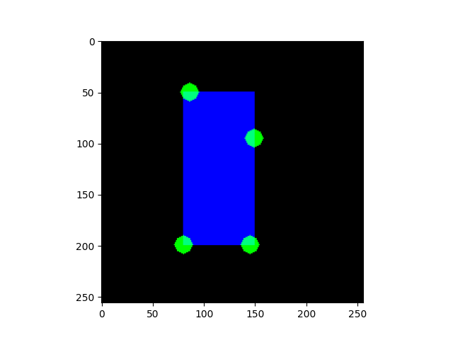

# ISISIM
**I**nteractive **S**egmentation **I**nteraction **SIM**ulation : simulate user interaction for interactive segmentation algorithms.

## Examples
*blue = label, green = positive click, red = negative click, the click maps are dilated for better visualization.*  
α *: random uniform (+) around border (-).* β *: extreme points*

| algo | single object | multiple objects |
| --- | --- | --- |
| α |  |  |
| β |  |  |
| α |  |  |
| β |  | |

## Benchmark
More details in example*.py benchmark functions.

* single object image size : (256 x 256 x 256)
* multiple objects image size : (165, 512, 512)
* batch size : 32 (get_click_extreme_points is run only once)
* clicks : 10

* α : single object, proportion of positive label : 48.7%
* α- : α inverted label
* β : single object, proportion of positive label : 0.8%
* β- : β inverted label
* γ . multiple objects, proportion of positive label : 5.2%
* γ- : γ inverted label

| function | α | α- | β | β- | γ | γ- |
| --- | --- | --- | --- | --- | --- | --- |
| generatorS.gen_click_random_uniform | 0.148 | 0.196 | 0.047 | 0.313 | 2.651 | 2.798 |
| generatorS.gen_click_random_uniform_advanced | 46.085 | 47.545 | 13.984 | 97.604 | 32.83 | 125.931 |
| generatorS.gen_click_around_border | 62.642 | 68.518 | 2.859 | 6.725 | 49.017 | 236.719 |
| generatorS.get_click_extreme_points | 0.719 | 0.785 | 0.303 | 1.27 | 14.947 | 7.031 |

## References
* [Deep Interactive Object Selection (Xu et al. 2016)](https://arxiv.org/abs/1603.04042) [:scroll:](references/1603.04042.pdf)
* [Deep Extreme Cut: From Extreme Points to Object Segmentation (Maninis et al. 2018)](https://arxiv.org/abs/1711.09081) [:scroll:](references/1711.09081.pdf)
* [Getting to 99% Accuracy in Interactive Segmentation (Forte et al. 2020)](https://arxiv.org/abs/2003.07932) [:scroll:](references/2003.07932.pdf)

If you are interested in user interaction simulation, this repository may interest you :
[SegmentationToScribble](https://github.com/Cyril-Meyer/SegmentationToScribble)
